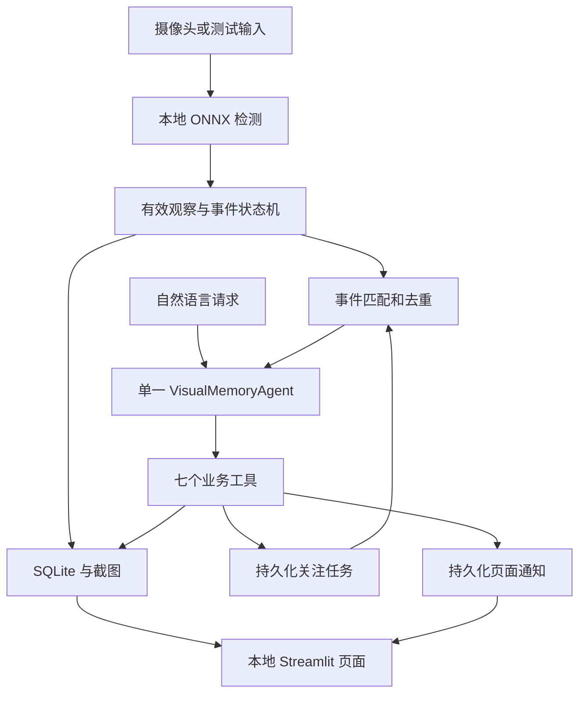

# 技术架构与现行决策

状态：设计约定，尚未实现。原始计划保存在 [基线](project-plan-baseline.md)。2026-09-07 的环境讨论补充推荐：原生开发为主，Docker 非首版前置条件。

## 系统组成

采用 Python 3.11、OpenCV、YOLO26n ONNX、ONNX Runtime CPU、Supervision、SQLite、OpenAI Agents SDK 和 Streamlit。使用 uv 管理环境和锁文件。版本必须在阶段 00/02 验证后填写，不用未知的最新版本作为默认值。

复用 SDK 的循环与工具执行、Supervision 的检测表示和绘制、YOLO 的权重和导出。项目自行实现事件、视觉记忆、任务与页面。Frigate 只作设计参考。[来源](references.md)

## 运行环境决策

原生 Mac/Windows 进程访问摄像头，不通过 Docker Desktop 转接 USB。原因是单摄像头项目对本机设备依赖强，虚拟机与 USB/IP 增加配置和兼容验证，且不会降低模型 Token 或必需推理计算量。

输入适配支持摄像头、录像回放与模拟观察。容器化不改变业务接口；未来有独立需求时可添加 Linux 回放测试或原生 Ubuntu + Docker Engine 部署。首版不创建 Dockerfile、Compose 或 Dev Container，不要求用户安装 Ubuntu。双平台仍须分别验收。

## 感知与时序

默认请求 640×480 摄像头画面，记录实际获得的分辨率；输入按比例填充至模型需要的 640×640。每秒推理一次，预览每秒最多两次；ONNX CPU 使用两个线程并关闭空闲自旋。只保留最新待处理帧，不积压历史视频。提供每两秒推理一次的省电档。

使用非镜像画面坐标，以检测框中心确定左/中/右区域。关注类别为 cell phone、cup、bottle；类别映射以实际模型元数据核验。多个同类物品返回多个候选，不生成身份结论。

连续三次有效采样确认出现；连续五秒有效观察均未检测到，生成类别持续未检测到事件。样本缺口、暂停、断连或严重处理延迟令状态未知并重置连续确认区间，不算缺失时间；实现阶段结合采样间隔验证新鲜度。用单调时钟计算进程内持续时间，带时区的时间用于持久化和展示。

事件事实按类别及区域组织，不将区域变化表述为已证明的同一物品移动。历史查询保留 last_seen 时间，不能把“最后看到”回答成“现在一定在”。

## 最小接口约定

以下是计划接口，尚无实现。类型使用 Python 类型标注及适当的数据校验，内部实现不暴露任意 SQL、代码或 Shell。

| 类型 | 最少表达的内容 |
|---|---|
| Detection | 类别、置信度、边界框、画面区域 |
| SceneObservation | 观察时间、摄像头状态、画面新鲜度、检测列表 |
| VisualEvent | 唯一事件 ID、事实类型、类别、区域、观察与确认时间、证据引用 |
| WatchTask | 任务 ID、类别、条件、建立/到期时间、状态、已处理事件 |
| ToolResult | 成功状态、返回数据或错误、必要的时间与证据引用 |

| Agent 工具 | 约定 |
|---|---|
| get_current_scene() | 返回最近有效观察和新鲜度，不隐去故障 |
| find_object(category) | 返回最后观察和候选，无记录明确说明 |
| search_events(category, start, end) | 限定时间范围，最多二十条并说明是否截断 |
| create_watch(category, condition, duration_minutes) | 支持出现/持续未检测到，默认三十分钟，返回实际建立结果 |
| list_watches() | 返回任务列表、状态与期限 |
| cancel_watch(watch_id) | 幂等取消；说明已取消、已结束或未找到 |
| notify_user(watch_id, event_id, message) | 验证任务、事件、事实与有效期，去重后写入页面通知 |

GUI 与 Agent 共用业务服务。模型生成说明文字不能充当写入成功的证据。

## 关注任务与唤醒

任务状态：等待、处理中、完成、取消、过期。任务只能消费建立后符合条件的事件；缺失关注须先有该类物品的有效出现依据，不能对从未见过的物品立即告警。首次成功提醒后完成。

事件匹配后把任务和事件引用送入独立 Agent 队列。Agent 查询当前状态和关联证据，决定是否通过通知工具提醒。模型不可直接更改任务状态；状态由工具事务维护。通知以任务 ID 和事件 ID 去重；取消/过期后不得接受迟到提醒。

创建操作使用业务请求 ID 去重，模型或网络重复调用不能重复建立相同请求的任务。进程重启恢复未到期任务，处理中任务先核对通知记录；停机期间不合成事件。失败或调用限额触发时可生成有事实依据的本地规则提醒，并标明降级来源；不把它统计成 Agent 完成。

## 存储、工作线程与 UI

SQLite 持久化最新观察、事件、任务、通知和用量/执行摘要；对话历史独立于视觉事实。应用服务控制写事务和连接使用，不跨线程直接共享未配置的连接。

截图仅在有意义事件和最后观察证据需要时保存；普通事件与截图保留七天，保留每类物品最后观察所引用的证据。清理时遵守引用关系，不留下悬空引用或删除受保护证据。不录制完整视频。

采集、推理、Agent 请求与 UI 刷新相互解耦。进程只建立一个对应摄像头和模型的工作实例；Streamlit 重运行不重复启动线程。停止时释放摄像头，错误可见；页面仅监听本机。

## 模型与成本

明确配置 API 地址、模型名称和环境变量中的 Key；无配置不使用 SDK 隐含模型，不调用云端，UI 标注 Agent 未连接。兼容提供商的工具调用能力需实际验证。

- 用户请求或匹配关注的事件才唤醒 Agent；等待零模型调用。
- 每次运行最多三轮模型请求；关闭自动网络重试，额度包含实际请求尝试。
- 单次事件工具最多二十条；对话携带最近五个完整交互，保持工具调用和结果配对。
- 自动事件每天最多二十次 Agent 运行，可配置；用户主动请求另计。日界线使用配置时区，默认 Asia/Shanghai。
- 云端只接收文字事实、时间与证据编号，不上传画面、截图或私人文件。
- 默认关闭云端 tracing；记录实际用量，缺失的用量标为不可用而非零。

请求设有限超时，模型失败不阻塞采集。具体提供商配置和验证结果进入该阶段 context，Key 不进入文档或测试证据。

## 尚待实测

模型导出与 ONNX 输出一致性、不同平台依赖、USB 采集后端、三类小物体效果、CPU/内存/延迟、具体 API 工具调用。以上是实施验证项，不是重新开放已确定的首版范围。
