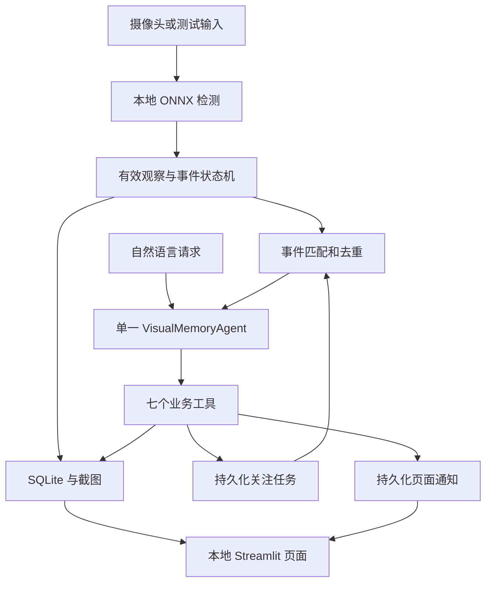

# 技术架构与现行决策

状态：现行实现架构；源代码与离线验证已建立，真实模型/摄像头/Windows验收另记。原始计划保存在 [基线](project-plan-baseline.md)。2026-09-07 的环境讨论补充推荐：原生开发为主，Docker 非首版前置条件。

## 系统组成

采用 Python 3.11、OpenCV、YOLO26n ONNX、ONNX Runtime CPU、Supervision、SQLite、OpenAI Agents SDK 和 Streamlit。使用 uv 管理环境和锁文件。实际版本锁定于 uv.lock，模型校验与导出版本见 model_manifests。

复用 SDK 的循环与工具执行、Supervision 的检测表示和绘制、YOLO 的权重和导出。项目自行实现事件、视觉记忆、任务与页面。Frigate 只作设计参考。[来源](references.md)

## 运行环境决策

原生 Mac/Windows 进程访问摄像头，不通过 Docker Desktop 转接 USB。原因是单摄像头项目对本机设备依赖强，虚拟机与 USB/IP 增加配置和兼容验证，且不会降低模型 Token 或必需推理计算量。

输入适配支持摄像头、录像回放与模拟观察。容器化不改变业务接口；未来有独立需求时可添加 Linux 回放测试或原生 Ubuntu + Docker Engine 部署。首版不创建 Dockerfile、Compose 或 Dev Container，不要求用户安装 Ubuntu。双平台仍须分别验收。

## 感知与时序

默认请求 640×480 摄像头画面，记录实际获得的分辨率；输入按比例填充至模型需要的 640×640。每秒推理一次，预览每秒最多两次；ONNX CPU 使用两个线程并关闭空闲自旋。只保留最新待处理帧，不积压历史视频。提供每两秒推理一次的省电档。

可选请求1280×720或1920×1080，并用归一化矩形选择观察范围；默认保持全画面。CameraSource只返回当前裁剪帧，检测、预览、证据和左/中/右使用同一裁剪坐标。范围外不是观察证据，不能推断整个环境中的存在或消失。修改设备、分辨率或范围须先停止旧工作器并重建事件基线，保留历史及关注；仅改采样档位仍只重置连续确认区间。具体输入组合的收益与限制见[实机改进复验](camera-remediation-2026-09-08.md)。

使用非镜像画面坐标，以检测框中心确定左/中/右区域。关注类别为 cell phone、cup、bottle；类别映射以实际模型元数据核验。多个同类物品返回多个候选，不生成身份结论。

连续三次有效采样确认出现；连续五秒有效观察均未检测到，生成类别持续未检测到事件。样本缺口、暂停、断连或严重处理延迟令状态未知并重置连续确认区间，不算缺失时间；实现阶段结合采样间隔验证新鲜度。用单调时钟计算进程内持续时间，带时区的时间用于持久化和展示。

事件事实按类别及区域组织，不将区域变化表述为已证明的同一物品移动。历史查询保留 last_seen 时间，不能把“最后看到”回答成“现在一定在”。

## 最小接口约定

以下接口已在 visual_ai_agent 包实现。类型使用 Python 类型标注及适当的数据校验，内部实现不暴露任意 SQL、代码或 Shell。

| 类型 | 最少表达的内容 |
|---|---|
| Detection | 类别、置信度、边界框、画面区域 |
| SceneObservation | 观察时间、摄像头状态、画面新鲜度、检测列表 |
| VisualEvent | 唯一事件 ID、事实类型、类别、区域、观察与确认时间、证据引用 |
| WatchTask | 任务 ID、类别、条件、建立/到期时间、状态、已处理事件 |
| ToolResult | 成功状态、返回数据或错误、必要的时间与证据引用 |

| Agent 工具 | 约定 |
|---|---|
| get_current_scene() | 返回最近有效观察和新鲜度，不隐去故障 |
| find_object(category) | 返回最后观察和候选，无记录明确说明 |
| search_events(category, start, end) | 限定时间范围，最多二十条并说明是否截断 |
| create_watch(category, condition, duration_minutes) | 支持出现/持续未检测到，默认三十分钟，返回实际建立结果 |
| list_watches() | 返回任务列表、状态与期限 |
| cancel_watch(watch_id) | 幂等取消；说明已取消、已结束或未找到 |
| notify_user(watch_id, event_id, message) | 验证任务、事件、事实与有效期，去重后写入页面通知 |

GUI 与 Agent 共用业务服务。模型生成说明文字不能充当写入成功的证据。

## 关注任务与唤醒

任务状态：等待、处理中、完成、取消、过期。任务只能消费建立后符合条件的事件；缺失关注须先有该类物品的有效出现依据，不能对从未见过的物品立即告警。首次成功提醒后完成。

事件匹配后把任务和事件引用送入独立 Agent 队列。Agent 查询当前状态和关联证据，决定是否通过通知工具提醒。模型不可直接更改任务状态；状态由工具事务维护。通知以任务 ID 和事件 ID 去重；取消/过期后不得接受迟到提醒。

创建操作使用业务请求 ID 去重，模型或网络重复调用不能重复建立相同请求的任务。进程重启恢复未到期任务，处理中任务先核对通知记录；停机期间不合成事件。失败或调用限额触发时可生成有事实依据的本地规则提醒，并标明降级来源；不把它统计成 Agent 完成。

## 存储、工作线程与 UI

SQLite 持久化最新观察、事件、任务、通知和用量/执行摘要；对话历史独立于视觉事实。应用服务控制写事务和连接使用，不跨线程直接共享未配置的连接。

截图仅在有意义事件和最后观察证据需要时保存；普通事件与截图保留七天，保留每类物品最后观察所引用的证据。清理时遵守引用关系，不留下悬空引用或删除受保护证据。不录制完整视频。

采集、推理、Agent 请求与 UI 刷新相互解耦。进程只建立一个对应摄像头和模型的工作实例；Streamlit 重运行不重复启动线程。停止时释放摄像头，错误可见；页面仅监听本机。

## 模型与成本

2026-09-09新增限定行为实验：两个独立YOLO26n-cls分类器分别输出姿态状态与疑似饮水，实验时序层组合起身/坐下等事件。训练及ONNX验证入口独立于ApplicationRuntime，未接入生产摄像头、物品事件、数据库或七业务工具。结果与限制见[行为试训报告](behavior-training-r01-20260909.md)，实现约定见[上下文](../harness/context/behavior-training.md)。

2026-09-09新增用户授权的本地场景微调工作流，详见[上下文](../harness/context/scene-finetune.md)。训练在隔离工具环境中进行，正式运行仍使用经过校验的ONNX CPU模型。三类实验权重的类别顺序与原COCO索引不同，必须在实验评估/导出中显式核验，不能复用原模型清单或绕过SHA校验。训练不改变Agent业务工具、摄像头事件契约或云端数据范围。

实验分为重建三类头（0/1/2）与保留原80类头（业务索引39/41/67）两种显式模式，训练器和评估器分别核验精确类别表；后者不扩展产品识别范围。过程与实际选择见[训练日志](../训练日志.md)。

明确配置 API 地址、模型名称和环境变量中的 Key；无配置不使用 SDK 隐含模型，不调用云端，UI 标注 Agent 未连接。兼容提供商的工具调用能力需实际验证；已验证的百炼配置见 [千问接入](qwen.md)。

- 用户请求或匹配关注的事件才唤醒 Agent；等待零模型调用。
- 首轮要求真实模型从七工具中自主选择，执行后恢复自然语言答复；零工具答复不记为业务完成。历史答案须引用实际时间、区域和证据，不补写未返回事件。
- 每次运行最多三轮模型请求；关闭自动网络重试，额度包含实际请求尝试。
- 单次事件工具最多二十条；对话携带最近五个完整交互，保持工具调用和结果配对。
- 自动事件每天最多二十次 Agent 运行，可配置；用户主动请求另计。日界线使用配置时区，默认 Asia/Shanghai。
- 云端只接收文字事实、时间与证据编号，不上传画面、截图或私人文件。
- 默认关闭云端 tracing；记录实际用量，缺失的用量标为不可用而非零。

请求设有限超时，模型失败不阻塞采集。具体提供商配置和验证结果进入该阶段 context，Key 不进入文档或测试证据。

## 尚待实测

模型导出与 ONNX 输出一致性、不同平台依赖、USB 采集后端、三类小物体效果、CPU/内存/延迟、具体 API 工具调用。以上是实施验证项，不是重新开放已确定的首版范围。

## 实现索引与实际边界

- `models.py`：Pydantic 领域记录，带时区时间和固定类别/条件。
- `vision.py`：CameraSource、ReplaySource、YoloOnnxDetector、VisionWorker；模型清单与配置 SHA 校验，检测输出为固定端到端头。
- `events.py`：仅进程单调时间推进确认；候选状态随 SQLite 事务成功后采用。
- `memory.py`：MemoryStore，版本 2；版本 1→2 先用 SQLite backup 备份再迁移，未知版本写前拒绝；每线程独立连接和显式事务。
- `watches.py`：WatchService，waiting/processing 原子认领、通知事务与引用保留。
- `agent.py`：AgentService 的 async run_user/run_event/close。真实客户端和 Runner 均禁重试；整体超时默认 30 秒，最多三次模型请求。第三轮已执行成功的通知以工具记录确认完成，不再额外请求文字结尾。
- `runtime.py`：ApplicationRuntime；一个有界 64 项的串行 Agent 队列，与视觉线程独立。启动恢复 processing 事件，队列满以事实生成本地降级；每小时清理普通数据。
- `app.py`：全局缓存一个线程安全运行时，原生文件锁限制同目录多进程；局部定时刷新不调用模型。

默认模型路径为 `models/yolo26n-e2e.onnx`，清单为 `model_manifests/yolo26n-e2e.onnx.json`。配置见 `.env.example`。每次导出可能因时间元数据改变哈希，必须用准备脚本重新完成输出对比并写入实际清单；不能伪造清单绕过验证。

当前实现保留每类最新观察及事件截图；普通持续检测的旧截图在引用释放后删除，普通观察/事件七天清理。被任务或通知引用的旧事件/截图保留以保证证据完整，因此此类数据可超过七天。对话仅保留最近五个完整用户/助手交互，当前调用的工具输入/输出由 SDK 保持配对，历史工具摘要在独立表记录。

用量同时表达已知部分值与 `usage_complete`，后续请求失败不能抹掉先前实际用量，也不能将部分用量宣称为总量。未知 API 能力、Windows 实机和摄像头小物体效果仍须验收。

可选 `CupScaleRecheckDetector` 在原图没有杯子时，用同一n模型对同一新鲜画面执行一次0.75缩放复查，仅补充杯子、逆映射到原图，仍只生成一条观察。默认关闭，改变开关先停止并重建当前事件基线；采样新鲜度与三次/五秒规则保持不变。实现与实测边界见[杯子复查](cup-scale-recheck-2026-09-08.md)。

## 2026-09-11 行为与情境集成扩展

现行行为类型、共享摄像头、SQLite v3、七工具兼容扩展和规则时序语义见[行为产品集成](behavior-product-integration.md)。实验模型标识保留；本轮暂缓长尾专项、物品训练和钥匙/合盖、自定义区域，不将基础规则框架视为这些视觉能力已完成。实际验证见build-log。

## 2026-09-12 可选笔记本能力与候选行为更新

`ApplicationRuntime` 新增独立 `LaptopWorker`，与物品和行为订阅同一个 `SharedCamera`。`LaptopObservation` / `LaptopEvent` / `LaptopStore` 不混入行为时长；SQLite v4 迁移前备份，当前笔记本观察只保留一条，事件和证据持久化。七个原工具通过受控 scope/trigger 扩展查询和开合规则，不新增执行工具。加载需绑定独立验收、状态与在场模型及 SHA；当前没有合格 capability，默认关闭。契约和故障语义见[笔记本接入](laptop-product-integration.md)。

姿态退出边缘证据独立于人体持续可见支持，只维护站立至空座的有限前态，不能恢复饮水、坐下或故障缺口；见[离座修复](behavior-exit-evidence-20260912.md)。饮水 r03 为可复现的实验候选，适用结果见[训练报告](drinking-training-20260912.md)。正式默认模型维持原配置，候选可用于显式验证，不等同于实机质量验收通过。
